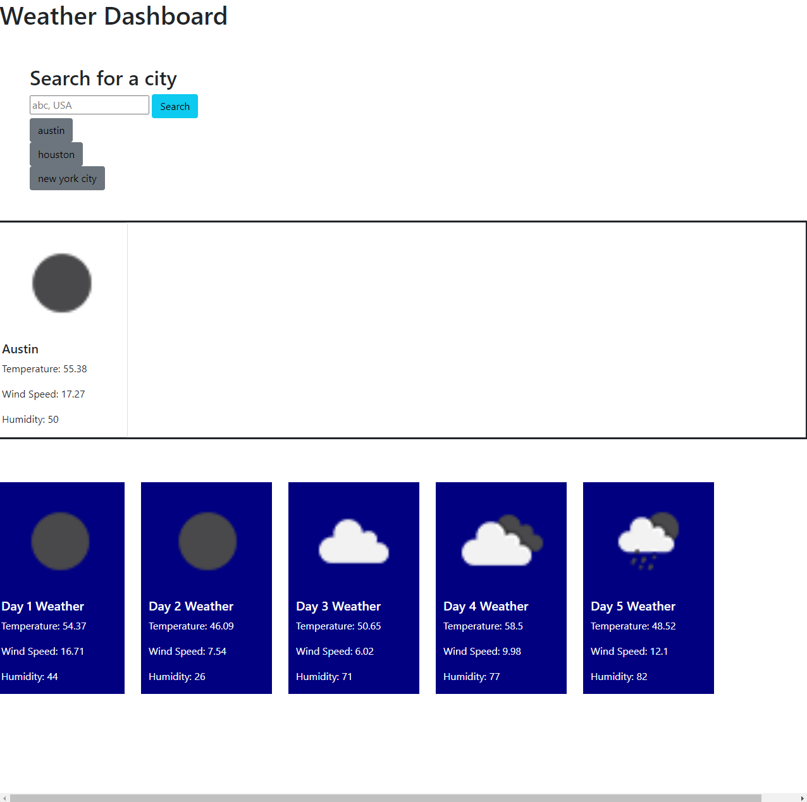

# Weather-Dashboard
## Table of Content
[About and Usage](#about--usage)

[Credits](#credits)

[Screenshot](#screenshot)

[Links](#links)

## About & Usage
Making a weather dashboard using the [Open Weather API database](https://openweathermap.org/forecast5). The application allows a user to search for a city in the US and they will be presented with the current conditions of said city along with a five day forecast.

## Credits
All of the weather and forecast data is being pulled from the Open Weather API

## Screenshot

## Links
Github repo- https://github.com/lrubio013/Weather-Dashboard

Live application- https://lrubio013.github.io/Weather-Dashboard/